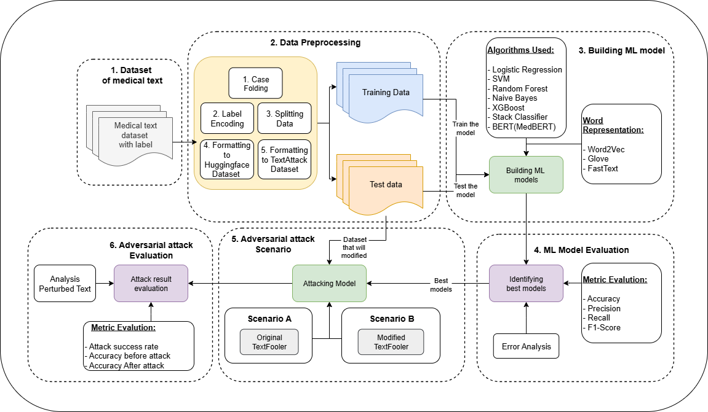

.. _overview:

Overview
==========

For researchers, engineers, and practitioners in artificial intelligence and healthcare domain, this project provides several insights, including

* **Model vulnerability assessment**: Exploring model vulnerabilities, particularly traditional machine learning models, Stack Classifier ensemble methods, and MedBERT when faced with adversarial attacks

* **Testing adversarial attack algorithms**: Conducting experiments using TextFooler to generate medical adversarial examples, then analyzing their impact on the built models and the similarity of the generated adversarial examples.

* **Algorithm comparison**: Presenting a comparison of several models built using different approaches in terms of accuracy or resilience to adversarial attacks.

For education, this project can serve as a valuable reference and resource for exploring artificial intelligence and its application in one of the most crucial fields, namely health and medicine. This project can help students research several key topics, namely:

* **Adversarial Attacks and Their Impact**: Understanding how subtle changes imperceptible to humans can influence AI model predictions, even those pre-trained for medical contexts.

* **Healthcare AI Security**: Investigating the application of AI in sensitive fields such as healthcare, where diagnostic errors can lead to fatal outcomes.

* **Robustness vs. Accuracy**: Demonstrating why models with near-perfect accuracy still fail when faced with adversarial attacks, and raising questions about what strategies can enhance the robustness of such AI.

By applying adversarial attacks to AI in the field of medical text data, this research contributes to the development of safer and more trustworthy AI. These findings highlight the urgent challenges in utilizing AI in the healthcare field to handle diverse inputs while maintaining diagnostic accuracy.

This research utilizes a medical text dataset describing conditions experienced by patients with lung disease across eight categories. Using this dataset, three machine learning approaches are evaluated: MedBERT, a Stack Classifier combining traditional algorithms, and traditional classification. The results show that while all models achieved nearly perfect accuracy (99.98%), their resilience varied when faced with adversarial attacks. MedBERT experienced the highest accuracy drop, decreasing to 14.60%, while the traditional machine learning model only dropped to 72.30% and the Stack Classifier to 94.60%.

This project offers reproducible testing for adversarial attacks in NLP within the medical field or can be replicated for other critical fields, driving research and development in the application of AI in such critical areas.

Some of the core components needed for this project include a dataset, the TextAttack library, and GPU support from Google Colab.

The dataset used is from Kaggle, titled “Lung X-Ray + Clinical Text.” This dataset contains medical image and text data with a total of 8 target classes. Each class includes approximately 10,000 images along with related clinical text instances. A more detailed explanation of the dataset can be found on the Dataset page.

The main library used is TextAttack, a specialized framework for performing adversarial attacks. TextAttack provides various functions for designing adversarial attack algorithms independently and is already equipped with implementations of several algorithms published in previous research.

Additionally, GPU usage on Google Colab is required to accelerate the Adversarial Attack process. This is also directly recommended by the TextAttack developers, as stated in their `web documentation <https://textattack.readthedocs.io/en/master/2notebook/0_End_to_End.html>`_

Of course, this project also utilizes several other supporting libraries, which will be explained in the Tools section.

Proposed workflow for this project
------------------------------------

.. raw:: html

   

Environment Setup
-------------------

This project is run entirely on **Google Colab**, so no manual installation is required on your local machine. All dependencies can be run directly in the Colab notebook.

Main libraries used:

- Python 3.11.13  
- TextAttack 0.3.10  
- datasets 0.4.5  
- evaluate 4.0.0  
- scikit-learn 1.5.2  
- Gensim 4.3.3  
- NLTK 3.9.1  
- XGBoost 2.1.4  
- Transformers 4.47.1  
- NumPy 1.26.4

Additionally, **Google Colab's GPU** is used to accelerate the *adversarial attack* process, but you can still run the code in your local environment.
